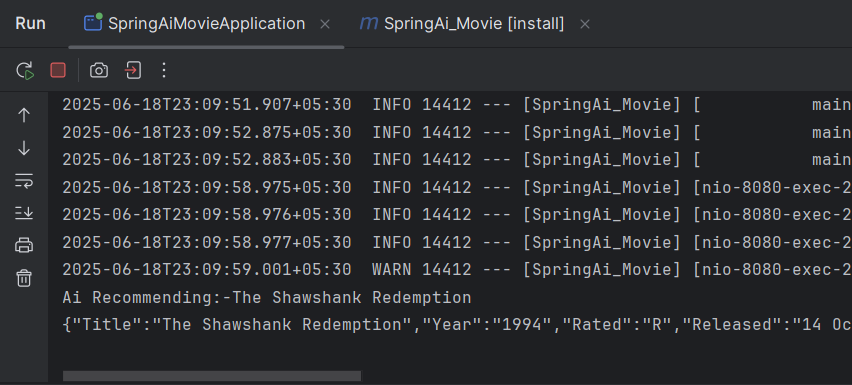
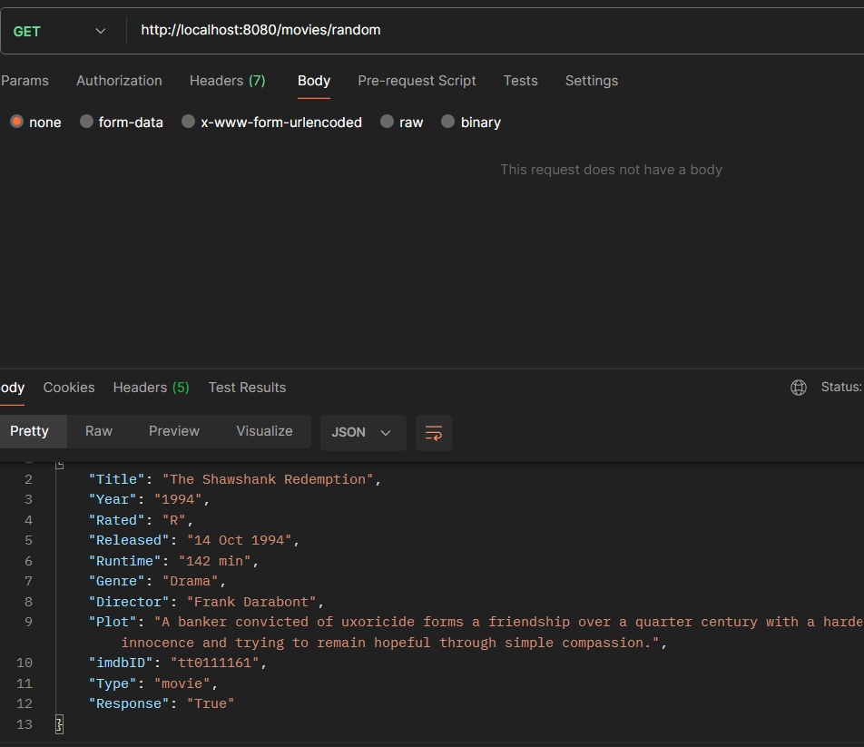
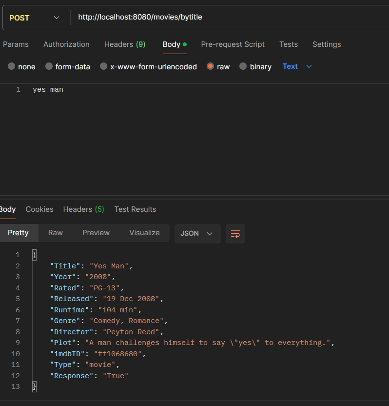
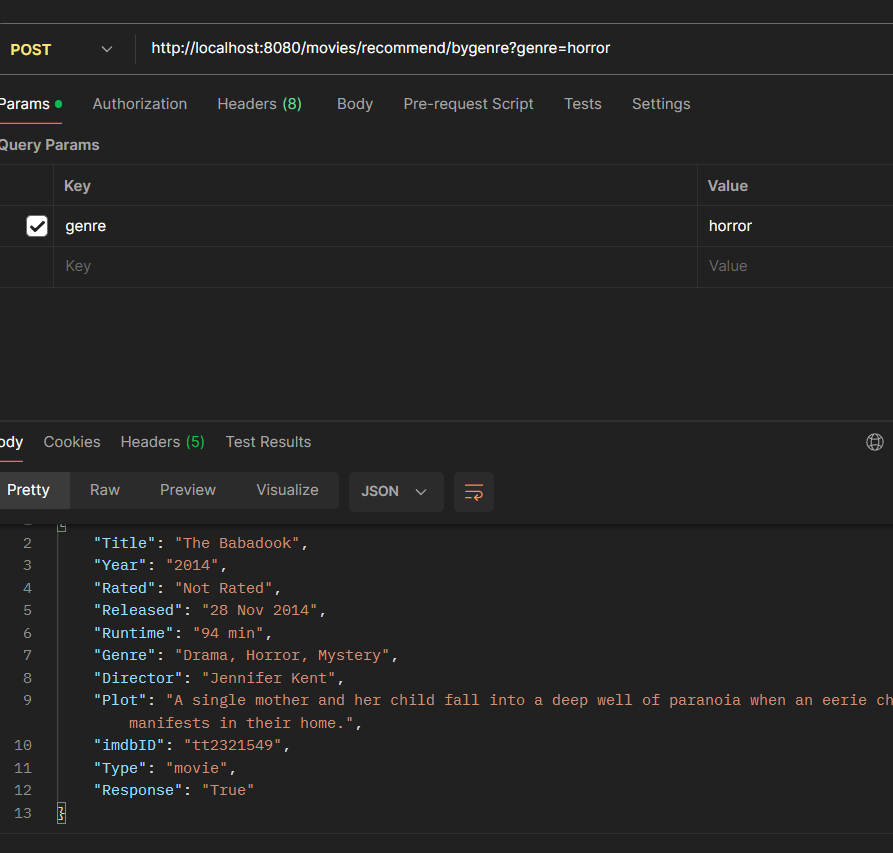

# Spring AI
This application is an demo working of spring AI
It is using ollama and is running the model on the local system. It uses of the ollama model
to randomly give out any movie name and the out put of AI is fed into another service which hits the omdb API to get all the information related to the movie
Uses can search by giving movie title to get plot,genre etc about movie

## AI Recommendation
URL :-_movies/random_

Above is the output of the recommendation from AI and this will be fed into omdb API to get whole details of the movie

omdb output

URL :- _/movies/bytitle_
## Search by title

It's an post method and users can pass the movie name as part of the body

## Recommend Based on Genre
URL : - _/movies/recommend/bygenre_(Requires params)

